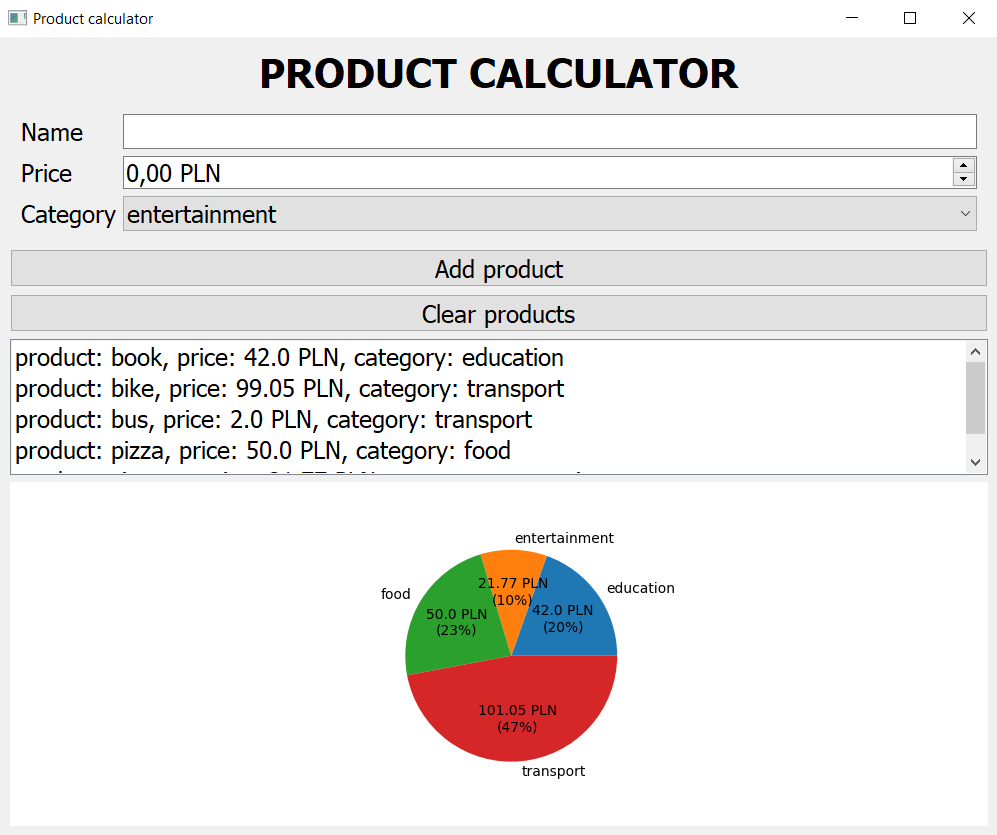

# Product Calculator App

## Overview
The Product Calculator app is a simple tool designed to calculate accumulated prices for different product categories.

## Features
- Calculates accumulated prices for different product categories.
- Simple and intuitive interface.
- Easily customizable for different datasets.

## Example Screen


## Installation
Clone the repository:
```bash
git clone https://github.com/0starzyk/product_calculator.git
```

## Setup
```bash
make init
```
